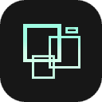
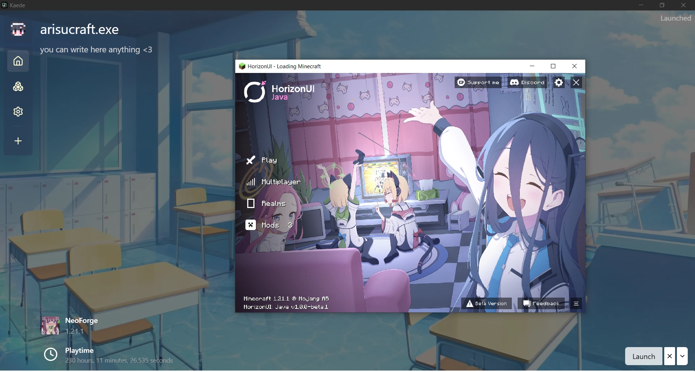
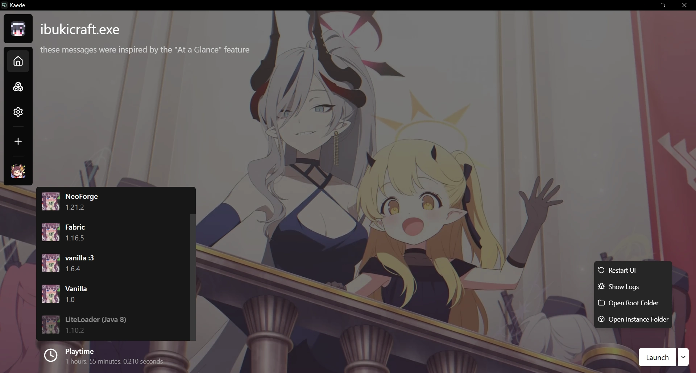
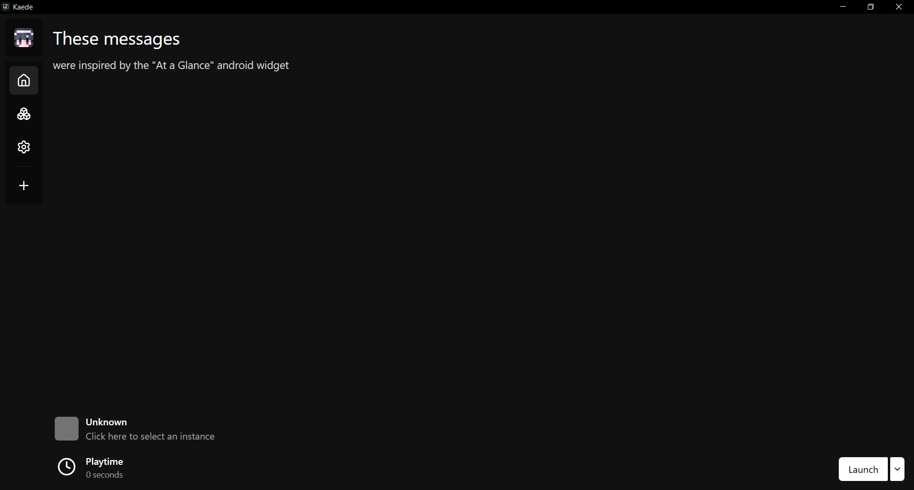
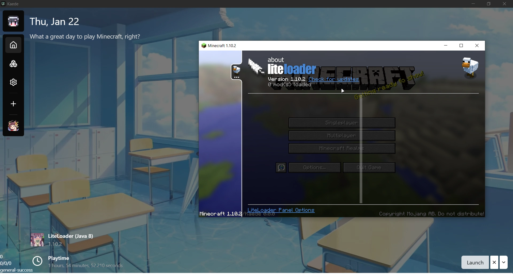
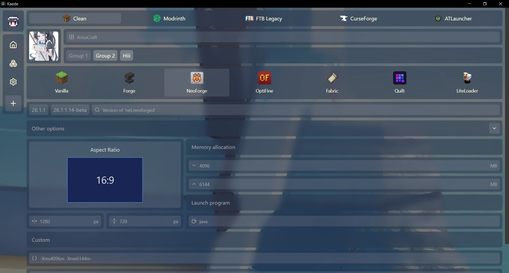
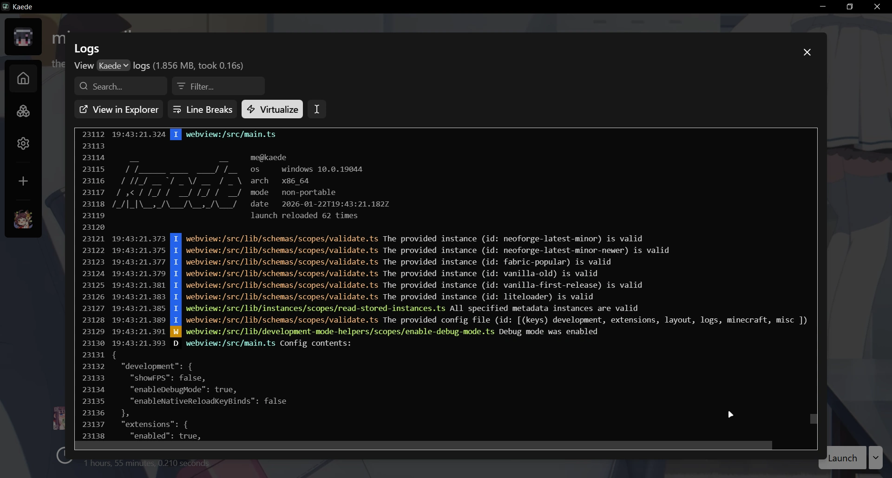
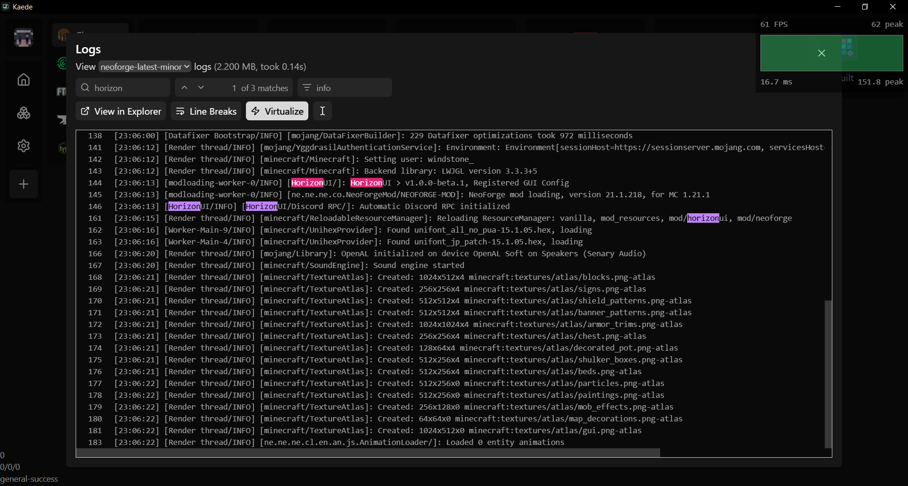
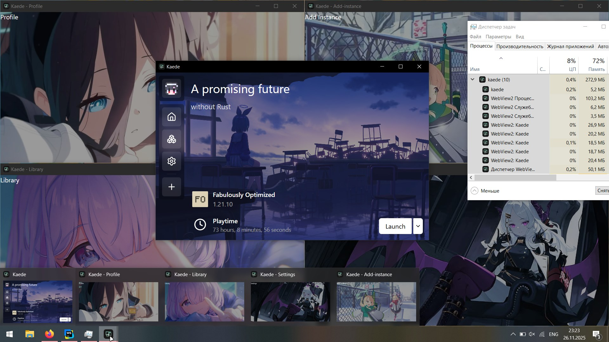

<div align="center">

<a target="_blank" href="https://bluearchive.wiki/wiki/Arisu">

</a>

<h1>
<a style="color:#a1fee4" href="https://github.com/kaede-basement/kaede">Kaede</a>
</h1>

A Tauri-based Minecraft launcher written in TypeScript with a permission-based plugin system

<p align="center">
<strong>English</strong> | <a style="color:#a1fee4" href="./README.ru.md">Русский</a> | Other languages?..
</p>

[![star-count]](https://github.com/kaede-basement/kaede/stargazers)
[![vue-badge]](https://vuejs.org/)
[![tauri-badge]](https://v2.tauri.app/)
[![unocss-badge]](https://unocss.dev/)

</div>

## Reason

The idea of applications ([Tachiyomi](https://github.com/tachiyomiorg)) and games ([Mindustry](https://github.com/Anuken/Mindustry)) having addons always fascinated me. The addition of features at runtime with one's own code, the modification of UI to one's own liking, and the ability to use others' plugins - sounds so awesome to me!

However, the existing Minecraft Launchers lack a user plugin system. While it is debatable whether extensible launchers for Minecraft are even needed, I still decided to make this project, primarily for myself.

## Demonstration

Screenshots of the launcher with or without user plugins.

<div align="center">

---

Home page and a launched Minecraft instance with the [HorizonUI mod](https://github.com/nokarin-dev/HorizonUI) by [nokarin-dev](https://github.com/nokarin-dev)



---

Home page with expanded version dropdown



---

Default state of the launcher with no plugins or themes



</div>

---

More screenshots >>>

<details>

<div align="center">

---

[LiteLoader](https://www.liteloader.com/) (by [Mumfrey](https://www.liteloader.com/explore/docs/people:mumfrey)) 1.10.2 launched through Kaede



---

Instance creation page



---

The log viewer



---

Filters & Searching



---

A custom plugin for the Multi-Window experience (each window adds 30 MB of RAM usage)



</div>

</details>

---

> [!NOTE]
> Assets from Blue Archive are not included in the launcher and are used here to merely demonstrate customizability of Kaede.
>
> This application is not affiliated with Yostar & NEXON Games.
>
> All information and assets used are the property and copyright of the respective authors.


## Features

- Plugin system
- Cross-platform (launching part is not tested on Linux and macOS yet)
- Fast startup
- Uses just 150 MBs of RAM (without plugins)
- MultiMC patch system
- Available as Non-Portable/Portable
- Open Source, GPL-3.0
- Written in TypeScript

## Installation

### Stable Releases

Download Kaede from the [GitHub Releases](https://github.com/kaede-basement/kaede/releases) page. Packages are available for Linux, Windows, and macOS.

### Development builds

Please understand that these builds are not intended for most users. There may be bugs and other instabilities.

The development builds are available through:

- [GitHub Actions](https://github.com/kaede-basement/kaede/actions) (includes builds from pull requests opened by contributors).
- [nightly.link](https://nightly.link/kaede-basement/kaede/workflows/build/nightly) (this link will always point only to the latest version of the `nightly` branch).

Prebuilt Development builds are provided for Linux, Windows, and macOS.

## Community & Support

If you want to report a bug or suggest a feature, please open an issue in [GitHub Issues](https://github.com/kaede-basement/kaede/issues).

### Discord

[![discord-banner]](https://discord.gg/zE2XcswKK7)

## Plans

Kaede is in early stages of development. Look at the [plan](./PLAN.md) to see more about this launcher >.<

## Contributing

No prior Rust knowledge is needed to contribute to this project. Most of the code was written in TypeScript using the Tauri API. These files will help in contributing:

- [README for TypeScript-related code](../src/README.md) (the most important one)
- [README for Rust-related code](../src-tauri/README.md)
- [Contributing Guidelines](./CONTRIBUTING.md)
- [MultiMC Patch System](./MULTIMC.md)
- [Building from Source](#building-from-source)

I also leave comments in the code.

For launcher plugins, themes, or translations:

- [Making a Plugin](./EXTENSIONS.md#making-a-plugin)
- [Type Declarations for Plugins](../types/README.md)
- [Making a Theme](./EXTENSIONS.md#making-a-theme)
- [Translating the Launcher](https://github.com/kaede-basement/translations)

Pull requests are welcome. AI code is not welcome (with the exception being user plugins). For major changes, please open an issue first to discuss what you would like to change.

In case if you want to run this launcher with [Wails](https://wails.io/) (or any other backend), see [the following file](../src/lib/README.md#browser).

## Building from Source

<details>

### Preparations

See [Tauri v2 Prerequisites](https://v2.tauri.app/start/prerequisites/).

I also recommend installing [bun](https://bun.sh/).

Once you are ready, clone this repository:

```bash
git clone https://github.com/kaede-basement/kaede

```

Navigate to the cloned directory and install project dependencies:

```bash
bun install
```

### Development

Run:

```bash
bun dev
```

### Release

Run:

```bash
bun run build
```

</details>

## License

[![license-badge]](https://github.com/kaede-basement/kaede/blob/main/LICENSE)

## Credits

Please refer to [this file](./CREDITS.md).

<!-- Variables -->

[star-count]: https://img.shields.io/github/stars/kaede-basement/kaede?label=Stars&style=for-the-badge&color=%23a1fee4&logo=data%3Aimage%2Fsvg%2Bxml%3Bbase64%2CPD94bWwgdmVyc2lvbj0iMS4wIiBlbmNvZGluZz0idXRmLTgiPz4KPHN2ZyBoZWlnaHQ9IjI0IiB2aWV3Qm94PSIwIC05NjAgOTYwIDk2MCIgd2lkdGg9IjI0IiB4bWxucz0iaHR0cDovL3d3dy53My5vcmcvMjAwMC9zdmciPgogIDxwYXRoIGQ9Im0zNTQtMjQ3IDEyNi03NiAxMjYgNzctMzMtMTQ0IDExMS05Ni0xNDYtMTMtNTgtMTM2LTU4IDEzNS0xNDYgMTMgMTExIDk3LTMzIDE0M1pNMjMzLTgwbDY1LTI4MUw4MC01NTBsMjg4LTI1IDExMi0yNjUgMTEyIDI2NSAyODggMjUtMjE4IDE4OSA2NSAyODEtMjQ3LTE0OUwyMzMtODBabTI0Ny0zNTBaIiBzdHlsZT0iZmlsbDogcmdiKDE2MSwgMjU0LCAyMjgpOyIvPgo8L3N2Zz4%3D%0A
[vue-badge]: https://img.shields.io/badge/vuejs-%2335495e.svg?style=for-the-badge&logo=vuedotjs&logoColor=%234FC08D
[tauri-badge]: https://img.shields.io/badge/tauri-%2324C8DB.svg?style=for-the-badge&logo=tauri&logoColor=%23FFFFFF
[unocss-badge]: https://img.shields.io/badge/unocss-333333.svg?style=for-the-badge&logo=unocss&logoColor=white
[discord-banner]: https://discordapp.com/api/guilds/1422266074908594199/widget.png?style=banner3
[license-badge]: https://img.shields.io/github/license/kaede-basement/kaede?style=for-the-badge
