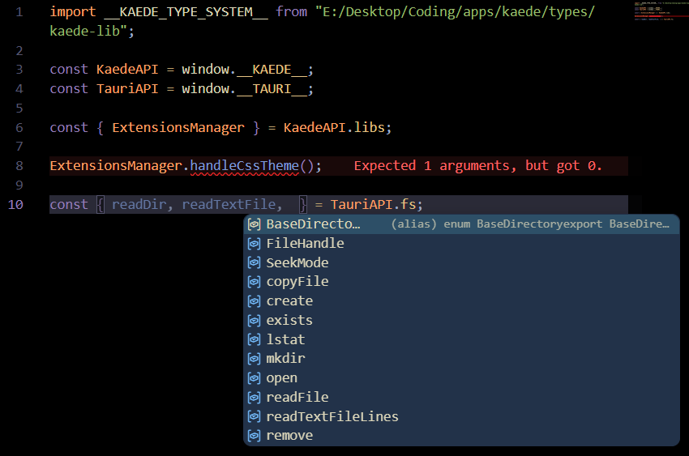

[<<< Back](../docs/README.md)

# Types

This directory contains `kaede-lib.d.ts` - a single type declaration file consisting of all Kaede types. With that file, the plugin development will be way easier since it describes every possible field of the `window.__KAEDE__` extension object.

For Tauri API types, consider installing the same set of `@tauri-apps/*` packages as specified in `package.json`. Another option is cloning this repository, installing all frontend dependencies (`bun install`), and importing the `kaede-lib.d.ts` file in your plugin code once again.

## Demonstration

